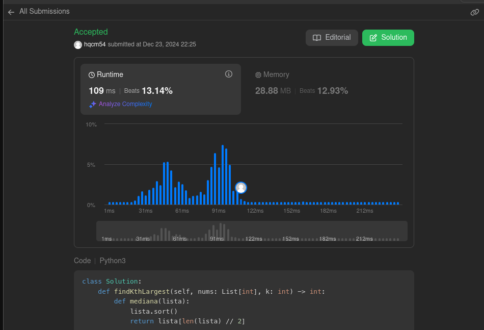

# Problemas

**Número da Lista**: 3 
**Conteúdo da Disciplina**: Dividir e conquistar 

## Alunos
|Matrícula | Aluno |
| -- | -- |
| 221022248  |  Carlos Eduardo Mota Alves |
| 221021993  |  Hugo Queiroz Camelo de Melo |

## Sobre 
Este projeto foi desenvolvido como parte da disciplina Projeto de Algoritmos. A dupla responsável por este projeto resolveu três questões no LeetCode, com o objetivo de aplicar e aprimorar conceitos de algoritmos e estrutura de dados.

## Screenshots

## Instalação 
**Linguagem**: python 

Antes de rodar o projeto, certifique-se de que você tem o Python instalado em sua máquina.

## Uso 
- Acesse os links das questões no LeetCode:
   - [Merge k sorted lists](https://leetcode.com/problems/merge-k-sorted-lists/description/)
   - [Kth largest element in an array](https://leetcode.com/problems/kth-largest-element-in-an-array/description/)
   - [Median of two sorted arrays](https://leetcode.com/problems/median-of-two-sorted-arrays/description/)

## Vídeo

[https://www.youtube.com/watch?v=lQ6znBlGZqU](https://www.youtube.com/watch?v=lQ6znBlGZqU)
